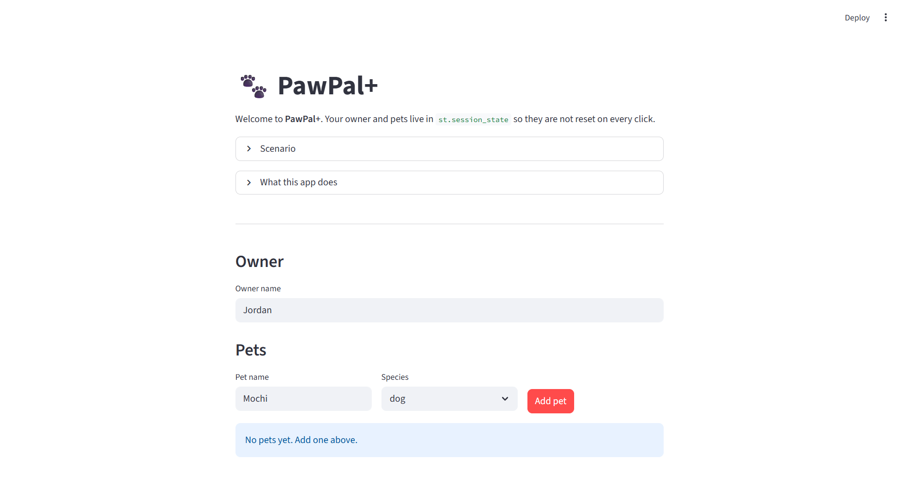

# PawPal+

**PawPal+** is a Streamlit app that helps a single pet owner plan care tasks across one or more pets. You define tasks with duration, frequency, and start times; the app persists state to JSON, rejects **overlapping** time windows when you add a task, surfaces conflicts in the UI, and builds an ordered daily plan with explanations. Optional **Gemini** + **RAG** (local `data/knowledge_base.json`) adds a short **AI_Why** line per step grounded in code facts and retrieved snippets.

---

## Features

Core scheduling lives in `pawpal_system.py` (`Owner`, `Pet`, `Task`, `Scheduler`, `DailyPlan`). Persistence and insert validation live in `pawpal_store.py`. The UI is in `app.py`.

- **JSON persistence** — Owner, pets, and tasks are saved to `data/pawpal_store.json` (created on first run). See `data/pawpal_store.example.json` for the schema. The real store file is gitignored so local data is not committed.

- **Overlap-safe task adds** — A new **incomplete** task is rejected if its half-open interval `[start, start + duration)` overlaps any other pending task on **any** pet (same owner). Tasks must not extend past **midnight** on the modeled day.

- **Conflict warnings** — `Scheduler.schedule_time_conflicts` uses the same overlap rule and groups overlapping pending tasks for the Scheduling insights panel.

- **Sorting by start time** — Pending tasks can be listed by normalized **HH:MM** (earliest first).

- **Filtering** — Pending tasks can be filtered by completion state and optionally by **pet name**.

- **Daily / weekly / once recurrence** — `Pet.complete_task(..., owner=owner)` marks work done and, for daily or weekly tasks, appends the next occurrence when it would **not** overlap another pending task (otherwise the append is skipped and a warning is logged). Pass **`owner=`** when you have the full owner graph so overlap checks are correct.

- **Plan generation** — `build_plan` orders pending tasks by recurrence tier, duration, pet name, and description. Each slot includes a **Why (code)** string.

- **RAG + Gemini (optional)** — On **Generate schedule**, the app retrieves top knowledge chunks (`pawpal_rag.py`) and calls **Gemini** (`gemini_client.py`) to produce **AI_Why** and **Sources** (cited snippet ids). Set `GOOGLE_API_KEY` or `GEMINI_API_KEY`. Override the model with `GEMINI_MODEL` (default `gemini-2.5-flash`; the client prefixes `models/` when needed).

---

## Demo

Replace the path below with your screenshot file (or drop the image next to this README and adjust the relative path).



---

## Requirements

- Python 3.10+ (uses modern typing such as `list[str]`, `date | None`)

Dependencies are in `requirements.txt` (Streamlit, pytest, `google-generativeai` for Gemini). Google may deprecate `google-generativeai` in favor of `google.genai`; if install warns, the app still runs with the key package until you migrate.

---

## Installation

```bash
python -m venv .venv
```

**Activate the virtual environment**

- **Windows:** `.venv\Scripts\activate`
- **macOS / Linux:** `source .venv/bin/activate`

```bash
pip install -r requirements.txt
```

### Environment (AI)

```bash
# Windows PowerShell
$env:GOOGLE_API_KEY = "your-key"

# Optional
$env:GEMINI_MODEL = "gemini-2.5-flash"
```

Without a key, the app still runs; schedule generation shows **Why (code)** only and a short caption about skipped AI.

---

## Run the app

From the project root (with the venv activated):

```bash
streamlit run app.py
```

The app loads `data/pawpal_store.json` on startup (or creates it with a default owner). Session state mirrors that data for the session; successful adds and owner-name changes write back to disk.

---

## CLI demo (optional)

```bash
python main.py
```

---

## Tests

```bash
pytest tests/ -v
```

Tests cover scheduling, JSON round-trip, overlap validation, keyword RAG retrieval, and a **mocked** Gemini JSON response (no network).

---

## Project layout

| Path | Role |
|------|------|
| `app.py` | Streamlit UI, persistence hooks, optional AI columns |
| `pawpal_system.py` | Domain model, overlap helpers, scheduler |
| `pawpal_store.py` | JSON load/save, `try_add_task` validation |
| `pawpal_rag.py` | Keyword retrieval over `data/knowledge_base.json` |
| `gemini_client.py` | Gemini call + JSON parsing for schedule explanations |
| `data/knowledge_base.json` | Curated snippets for RAG |
| `data/pawpal_store.example.json` | Example DB shape |
| `main.py` | Command-line demo |
| `tests/` | Pytest suites |
